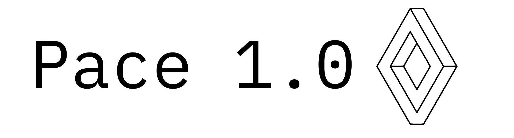

# Hi there! I'm Katsugachi  
  
**Mini Active Developer | Games & Projects | Making Things People Actually Want To Use**   
_All projects are made on **Chrome** and may not work on other browsers_   
Site: [https://katsugachi.github.io](https://katsugachi.github.io)   
Gemini 3.5: [https://www.google.com/search?udm=50&aep=11](https://www.google.com/search?udm=50&aep=11)
## I’m currently working on ...
### Solus Ms (Largest Project To Date)
An original gaming site with full games and a steam-like UI  
[https://github.com/Katsugachi/Solus-MS](https://github.com/Katsugachi/Solus-MS)  

### Spooftify 
An advanced offline music player with a clean UX and UI for easy importing and accessing to high quality music.  
[https://github.com/Katsugachi/Spooftify-V4](https://github.com/Katsugachi/Spooftify-V4/tree/main)  

  
[-1DB954?style=for-the-badge&logo=spotify&logoColor=white)](https://katsugachi.github.io/Spooftify-V4/)
### Pace

  

 
Local Lite Agent you can drop anywhere and get it working: formatting data, summarising tasks and you can ask it to do anything, understanding natural language. Pace is just 750mb in size and can run its tasks even on low end computers with under 1GB of RAM   
Details on how to install + Pace's Files and a more comprehensive description can be found here   

Pace Lite (General): https://github.com/Katsugachi/Pace-Lite-1.0   
Pace Architex (Advanced & Coding): https://github.com/Katsugachi/Pace-1.0-Architex   

#### Pace Lite vs Architex
Pace Lite is smart and has internet access while still being a local model, it does not try to rewrite its own code and is the stable, recommended model. Architex specialises in coding and has the same general capabilities as Pace Lite.

### ZenLit o2
Second version of a javascript engine with **~3650** ELO   
[https://github.com/Katsugachi/ZenLit-o2](https://github.com/Katsugachi/ZenLit-o2)  

### Calculator 2
Calculator Swiss Army Knife  
This is a special site and if you hit the save offline button it will allow you to visit this site even when you have no internet    
[https://github.com/Katsugachi/Calculator-2](https://github.com/Katsugachi/Calculator-2)  

### JRAHS Student ID
Student ID barcode generator from ID  
[https://github.com/Katsugachi/JRAHS-Student-ID](https://github.com/Katsugachi/JRAHS-Student-ID)  

  
### Accelerated Information Material (XiM Materials)
Highly efficient easy to use cramming tool  
[https://github.com/Katsugachi/XiM-Cram-Material](https://github.com/Katsugachi/XiM-Cram-Material)   

  

### Scramjet
Anticensorship internet tool  
[https://github.com/Katsugachi/Scramjet-Web](https://github.com/Katsugachi/Scramjet-Web)   
  

  

### Connect4 JS
Javascript connect 4 engine.   
[https://github.com/Katsugachi/Connect4-JS](https://github.com/Katsugachi/Connect4-JS)   

### Air Dollars
Fictional betting currency.   
[https://github.com/Katsugachi/AirDollars-TM](https://github.com/Katsugachi/AirDollars-TM)  

### Tempus Speed (WIP)
Ultra Fast Simple Temporary Communications App 
_Based On The Original Legacy Docscord (2025)_   
[https://github.com/Katsugachi/TempusSpeed](https://github.com/Katsugachi/TempusSpeed)  

  
also like 110+ more other repos 
  
luminescence skill link: [https://github.com/Katsugachi/Luminescence](https://github.com/Katsugachi/Luminescence)
## Have a good day!
  
